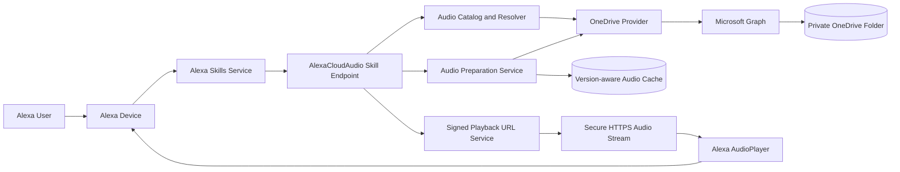
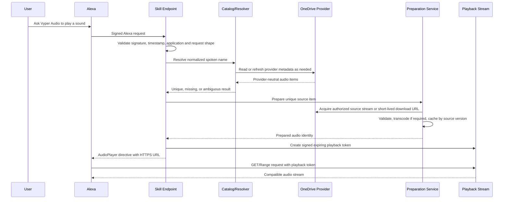

# AlexaCloudAudio MVP Architecture

## Purpose

AlexaCloudAudio lets an Alexa user request a personal audio file by spoken name and play it securely from a private OneDrive library.

Primary command:

> Alexa, ask Vyper Audio to play General Quarters.

The MVP is intentionally OneDrive-first while keeping storage-provider concerns behind application interfaces so a Google Drive provider can be added later without changing the Alexa, catalog, or playback domains.

## MVP boundaries

### Included

- Alexa custom skill named **Vyper Audio**.
- OneDrive audio discovery through Microsoft Graph.
- Case-insensitive, extension-independent name matching.
- Configurable aliases.
- Exact-match-first resolution with explicit ambiguity handling.
- WAV as a supported source format.
- Transcoding to an Alexa-compatible delivery format when required.
- Signed, expiring playback URLs.
- HTTP byte-range support.
- Play, pause, resume, stop, cancel, help, not-found, and ambiguous-match responses.
- Automated tests with at least 80% line and 80% branch coverage.

### Deferred

- Google Drive implementation.
- Playlists, queues, and randomized playback.
- Browser-based administration.
- Public skill certification.
- Multi-user commercial onboarding.
- Recommendation, search-ranking, or fuzzy-search features beyond documented normalization and aliases.

## System context



## Request and playback flow



## Major components

### AlexaCloudAudio.Domain

Contains stable business concepts and rules only:

- `AudioItem` and source-version identity.
- Normalized audio names and aliases.
- Resolution outcomes: unique, not found, and ambiguous.
- Playback token claims that do not depend on a web framework or cloud SDK.

It must not reference Microsoft Graph, Alexa SDK packages, ASP.NET Core, AWS SDKs, FFmpeg process wrappers, or persistence implementations.

### AlexaCloudAudio.Application

Coordinates use cases through interfaces:

- Resolve a requested sound.
- Refresh or query the catalog.
- Prepare audio for playback.
- Create and validate playback grants.
- Handle Alexa intent-level behavior through provider-neutral services.

Key abstractions include `IAudioLibraryProvider`, `IAudioCatalog`, `IAudioResolver`, `IAudioPreparationService`, `IPlaybackGrantService`, `IClock`, and `ISecretStore` or narrowly scoped credential abstractions.

### AlexaCloudAudio.Infrastructure

Implements external concerns:

- Microsoft Graph and OneDrive access.
- OAuth token acquisition and refresh.
- Audio metadata inspection and FFmpeg-based transcoding.
- Version-aware cache storage.
- Signed token implementation.
- Managed secret-store adapters.
- Structured logging and sensitive-data redaction.

### AlexaCloudAudio.Skill

Hosts the Alexa and playback HTTP endpoints:

- Alexa request validation.
- Intent and AudioPlayer event routing.
- Spoken responses and directives.
- Secure playback endpoint with byte-range support.
- Dependency injection, configuration, telemetry, and hosting integration.

The initial deployment target is AWS Lambda using ASP.NET Core-compatible hosting where practical. The application and infrastructure layers remain host-independent so an ordinary HTTPS-hosted ASP.NET Core deployment stays possible.

## Dependency rule

```text
Skill ----------> Application <---------- Infrastructure
                       |
                       v
                    Domain
```

- Domain depends on nothing else in the solution.
- Application depends only on Domain.
- Infrastructure implements Application interfaces and may depend on Domain.
- Skill composes the application and infrastructure and may reference both.
- Cloud SDK types never cross infrastructure boundaries.

## Security boundaries

### Alexa boundary

Every Alexa request must be validated for signature, certificate chain, request timestamp, expected skill/application identity, and supported request type before business processing.

### Microsoft identity boundary

- Use OAuth 2.0 authorization code flow with refresh support.
- Request only the least-privilege Microsoft Graph scopes needed for the configured audio library.
- Store refresh/access-token material only in the selected encrypted or managed secret store.
- Never place OAuth tokens in Alexa responses, application logs, cache keys, exception messages, or telemetry tags.

### Cloud download boundary

Microsoft Graph preauthenticated download URLs are short-lived secrets. They must be resolved only when needed, kept in memory for the shortest practical period, never returned to Alexa, and never persisted as durable catalog data.

### Playback boundary

Alexa receives only an AlexaCloudAudio HTTPS URL containing or referencing a signed, tamper-resistant, expiring playback grant. The grant identifies prepared audio, expiry, and permitted operation. It must not contain cloud credentials or source URLs.

### Audio-processing boundary

- Enforce configured maximum source size, duration, output size, processing time, and concurrency.
- Treat source files as untrusted input.
- Invoke FFmpeg without shell interpolation.
- Write temporary files only to controlled locations and delete them after success or failure.
- Prevent path traversal by using internal IDs rather than user-supplied paths.

### Logging boundary

Logs may contain correlation IDs, outcome categories, provider item IDs when approved, duration, and performance data. They must redact:

- Access and refresh tokens.
- Authorization headers.
- Microsoft Graph preauthenticated download URLs.
- Signed playback URLs or raw playback tokens.
- User audio contents.

## Audio compatibility and caching

- WAV is a source format, not a guaranteed delivery format.
- Source metadata is inspected before playback.
- Compatible sources may be passed through only when the selected Alexa playback path supports them.
- Incompatible sources are transcoded to the delivery format selected in the decision log.
- Prepared output is cached using provider ID plus immutable source-version metadata or a content hash.
- A changed source version produces a new cache identity.
- Concurrent preparation requests for the same cache identity share one in-flight operation.

## Name matching

The resolver performs deterministic matching:

1. Remove the file extension from catalog names.
2. Normalize Unicode, case, punctuation, separators, and repeated whitespace.
3. Check validated aliases and canonical names.
4. Prefer exact normalized matches.
5. Return an explicit ambiguous result when more than one item matches.
6. Never choose an arbitrary duplicate.

Fuzzy ranking is deferred until real usage demonstrates a need.

## Configuration and local development

Configuration is loaded through standard .NET configuration providers. Repository files contain placeholders only.

Local secrets use .NET user-secrets or environment variables. Deployed secrets use AWS Secrets Manager or an equivalent approved managed store selected by the deployment environment. Production credentials must never be committed to GitHub.

## Failure behavior

- Authentication failures return a safe relinking response or setup error without credential details.
- Missing audio produces a useful spoken not-found response.
- Ambiguous matches offer a bounded deterministic choice.
- Unsupported or oversized audio is rejected before expensive processing where possible.
- Transient Graph throttling uses bounded retry with jitter and honors server guidance.
- Playback grants fail closed when expired, invalid, or tampered with.

## Issue dependency order

1. #1 Architecture and decisions.
2. #2 Solution and TDD foundation.
3. #3 Domain model and provider-neutral catalog.
4. #4 Alexa request handling and interaction model.
5. #5 OneDrive provider.
6. #6 Secure preparation and streaming.
7. #7 CI/CD, security checks, and deployment documentation.
8. #8 Integrated OneDrive-backed MVP.
